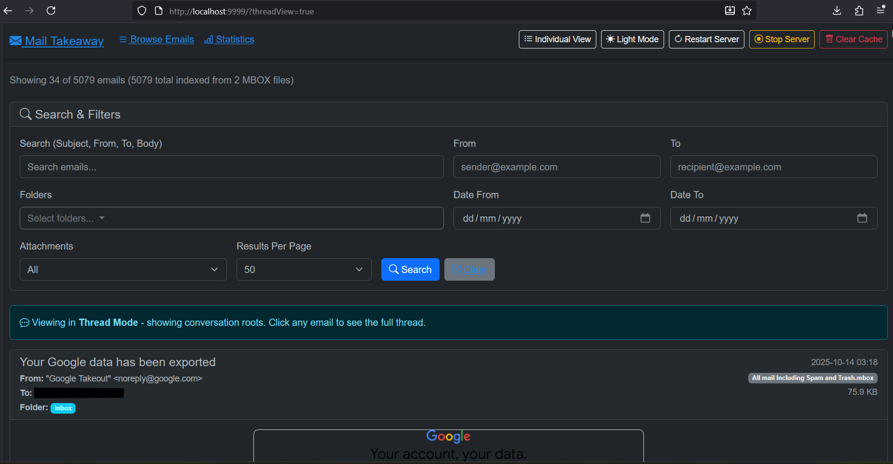

# Mail Takeaway

A powerful .NET 8 application for browsing and searching Google Takeout email archives (MBOX format) with full HTML rendering, inline images, and attachment support. Available as both a web application and an interactive console browser.



## Features

### Web Application
- **Parse Google Takeout Archives**: Direct support for `.tgz` files from Google Takeout
- **Full Email Rendering**: Complete HTML email display with inline images (using `cid:` content-ID resolution)
- **Gmail Labels**: Multi-label support - emails can appear in multiple folders
- **Advanced Search & Filtering**:
  - Full-text search across subject, from, to, and body
  - Multi-folder filtering with include/exclude options
  - Date range filtering
  - Attachment filtering by type (with counts)
  - Configurable results per page (20 to ALL)
- **Threaded Conversations**: View email threads with full reply chains
- **Attachment Support**: View and download all attachment types
  - **Images**: JPG, JPEG, PNG, GIF, BMP, WEBP (inline preview)
  - **Documents**: PDF, DOC, DOCX, ODT, XLS, XLSX, ODS
  - **Archives**: ZIP, GZ, 7Z, RAR, TGZ
  - **Audio**: MP3, WAV, OGG, M4A
  - **Code**: TXT, CS, C, CPP, JAVA
  - **And 52+ other file types**
- **Performance**:
  - JSON-based caching for instant subsequent loads
  - Processes 1000's of emails in seconds
  - Streaming MBOX parser for memory efficiency
  - Live progress tracking during indexing
- **Dark Mode**: Built-in dark theme with light mode toggle
- **Server Management**: Restart, stop, and clear cache directly from the web interface

### Console Application
- **Interactive Email Browser**: One-email-at-a-time viewing with keyboard navigation
- **Keyboard Controls**:
  - `←/→` or `N/P`: Navigate next/previous email
  - `Home/End`: Jump to first/last email
  - `PgUp/PgDn`: Jump 10 emails at a time
  - `S`: Search emails (subject/from/to/body)
  - `F`: Filter by folder
  - `C`: Clear all filters
  - `E`: Export current email to text file
  - `Q/ESC`: Quit
- **Full Message Display**: Shows complete email body with word wrapping
- **Real-time Filtering**: Search and folder filters update display instantly

## Requirements

- .NET 8 SDK (for building from source)
- **OR** Use pre-built self-contained executables (no .NET required!)
- Google Takeout archive (`.tgz` format) containing Gmail MBOX files

## Quick Start

### Option 1: Pre-built Executables (No .NET Required)

**Web Application:**
1. Download and extract `MailTakeaway.Web.exe` from releases
2. Place `MailDump.tgz` in the same folder
3. Double-click `MailTakeaway.bat` or run `MailTakeaway.Web.exe`
4. Open browser to `http://localhost:9999`

**Console Application:**
1. Download and extract `MailTakeaway.Console.exe` from releases
2. Place `MailDump.tgz` in the same folder
3. Run `MailTakeaway.Console.exe`
4. Use keyboard controls to browse emails

### Option 2: Build from Source

1. **Clone the repository**:
   ```bash
   git clone https://github.com/twobob/MailTakeaway.git
   cd MailTakeaway
   ```

2. **Configure your archive path**:
   Edit `MailTakeaway.Web/appsettings.json`:
   ```json
   {
     "ArchivePath": "MailDump.tgz",
     "Port": 9999
   }
   ```
   Place your Google Takeout `.tgz` file in the `MailTakeaway.Web` directory or provide an absolute path.

3. **Run the web application**:
   ```bash
   cd MailTakeaway.Web
   dotnet run
   ```
   Navigate to `http://localhost:9999`

4. **Or run the console application**:
   ```bash
   dotnet run --project MailTakeaway.Console
   ```

### Option 3: Build Self-Contained Executables

**Web Application:**
```bash
cd MailTakeaway.Web
dotnet publish -c Release -r win-x64 --self-contained true -p:PublishSingleFile=true -o publish
```

**Console Application:**
```bash
cd MailTakeaway.Console
dotnet publish -c Release -r win-x64 --self-contained true -p:PublishSingleFile=true -o publish
```

## Project Structure

```
MailTakeaway/
├── MailTakeaway.Core/          # Core parsing and indexing logic
│   ├── Models/                 # Email data models
│   └── Services/               # MBOX parser, archive processor
├── MailTakeaway.Web/           # ASP.NET Core MVC web application
│   ├── Controllers/            # MVC controllers
│   ├── Models/                 # View models
│   └── Views/                  # Razor views
└── MailTakeaway.Console/       # Command-line interface (optional)
```

## How It Works

1. **Archive Processing**: Reads `.tgz` files using GZipStream and TarReader
2. **MBOX Parsing**: Streams and parses MBOX files using MimeKit
3. **Gmail Labels**: Extracts labels from `X-Gmail-Labels` headers
4. **Inline Images**: Resolves `cid:` content-ID references to base64 data URIs
5. **Caching**: Stores parsed index in `email_index_cache.json` for fast subsequent access
6. **Threading**: Builds conversation threads using `Message-ID`, `In-Reply-To`, and `References` headers

## Configuration

`appsettings.json` options:

```json
{
  "ArchivePath": "MailDump.tgz",
  "Port": 9999
}
```

Use a relative path (file in same directory as web app) or absolute path to your archive.

## Technologies Used

- **.NET 8**: Modern C# web framework
- **ASP.NET Core MVC**: Web application framework
- **MimeKit 4.3.0**: MIME message parsing
- **SharpCompress 0.36.0**: Archive extraction
- **Bootstrap 5.3**: Responsive UI with dark mode
- **Bootstrap Icons**: Icon set

## Performance

On a typical Google Takeout archive:
- **5,000+ emails** indexed in ~30 seconds (first run)
- **Cache file**: ~15 MB JSON (instant loading on subsequent runs)
- **Memory efficient**: Streams MBOX files without loading entire archive
- **Console app**: Instant navigation between emails once loaded

## Usage Examples

### Web Application
1. Start the server
2. Use the search filters to find specific emails
3. Click on any email to view full details with inline images
4. Use folder filters to view emails by Gmail label
5. Filter by attachment type to find specific file types
6. Use the "Clear Cache" button to re-index after archive changes

### Console Application
1. Run the executable
2. Wait for indexing to complete
3. Navigate through emails with arrow keys
4. Press `S` to search for specific content
5. Press `F` to filter by folder/label
6. Press `E` to export the current email to a text file
7. Press `Q` to quit

## License

MIT License - feel free to use and modify as needed.

## Contributing

Pull requests welcome! Please ensure your code follows the existing style and includes appropriate error handling.

## Troubleshooting

- **Port already in use**: Change the port in `appsettings.json`
- **Archive not found**: Verify the path in `appsettings.json` uses escaped backslashes (`\\`) on Windows
- **Slow initial load**: First-time indexing can take time for large archives - use the progress indicator
- **Images not showing**: Clear cache and re-index to ensure inline images are processed

## Credits

Built to solve the problem of browsing Google Takeout email archives without re-importing to a mail client.
